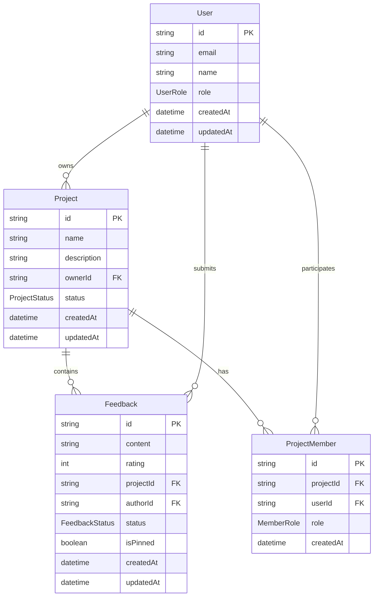

# Client Feedback Hub - Архітектура системи

## Огляд системи

Client Feedback Hub (CFH) - це SaaS платформа для збору та управління відгуками клієнтів, побудована на сучасному технологічному стеку з акцентом на масштабованість, безпеку та зручність використання.

## Технологічний стек

### Frontend
- **React 18** - Користувацький інтерфейс
- **TypeScript** - Типізація та розробка
- **Vite** - Збірка та розробка
- **React Router** - Маршрутизація SPA
- **React Query** - Управління серверним станом
- **Zustand** - Локальний стан
- **TailwindCSS** - Стилізація
- **shadcn/ui** - UI компоненти
- **React Hook Form + Zod** - Форми та валідація

### Backend
- **Node.js 18+** - Серверне середовище
- **Express.js** - Web фреймворк
- **TypeScript** - Типізація
- **Prisma ORM** - База даних
- **PostgreSQL** - СУБД
- **JWT** - Аутентифікація
- **Zod** - Валідація даних
- **Jest + Supertest** - Тестування

### DevOps і інфраструктура
- **Docker** - Контейнеризація
- **Docker Compose** - Локальна розробка
- **GitHub Actions** - CI/CD
- **ESLint + Prettier** - Якість коду
- **Husky** - Git hooks

## Архітектурні принципи

### 1. Мікросервісна архітектура
```
┌─────────────────┐    ┌─────────────────┐
│    Frontend     │    │    Backend      │
│   (React SPA)   │◄──►│  (Express API)  │
└─────────────────┘    └─────────────────┘
                              │
                       ┌─────────────────┐
                       │   PostgreSQL    │
                       │   (Database)    │
                       └─────────────────┘
```

### 2. Розділення відповідальності

#### Frontend структура
```
src/
├── components/     # Переиспользуемые UI компоненты
├── pages/         # Страничні компоненти
├── hooks/         # Кастомні React hooks
├── services/      # API клієнти та сервіси
├── store/         # Zustand stores
├── types/         # TypeScript типи
├── utils/         # Утилітарні функції
└── contexts/      # React contexts
```

#### Backend структура
```
src/
├── controllers/   # HTTP контролери
├── routes/        # Express маршрути
├── middleware/    # Express middleware
├── services/      # Бізнес логіка
├── models/        # Prisma моделі
├── utils/         # Утилітарні функції
├── types/         # TypeScript типи
└── __tests__/     # Тести
```

### 3. Layered Architecture (Backend)

```
┌─────────────────────────────────────┐
│           Controllers               │ ← HTTP обробка
├─────────────────────────────────────┤
│            Services                 │ ← Бізнес логіка
├─────────────────────────────────────┤
│        Data Access (Prisma)         │ ← Доступ до даних
├─────────────────────────────────────┤
│           Database                  │ ← Збереження даних
└─────────────────────────────────────┘
```

## Модель даних

### Основні сутності



### Перечисления (Enums)

```typescript
enum UserRole {
  ADMIN = 'ADMIN',
  MANAGER = 'MANAGER', 
  USER = 'USER'
}

enum ProjectStatus {
  ACTIVE = 'ACTIVE',
  INACTIVE = 'INACTIVE',
  ARCHIVED = 'ARCHIVED'
}

enum FeedbackStatus {
  PENDING = 'PENDING',
  APPROVED = 'APPROVED',
  REJECTED = 'REJECTED'
}

enum MemberRole {
  OWNER = 'OWNER',
  EDITOR = 'EDITOR',
  VIEWER = 'VIEWER'
}
```

## API Design

### RESTful принципи
```
GET    /api/projects        # Список проєктів
POST   /api/projects        # Створити проєкт
GET    /api/projects/:id    # Деталі проєкту
PUT    /api/projects/:id    # Оновити проєкт
DELETE /api/projects/:id    # Видалити проєкт

GET    /api/projects/:id/feedbacks     # Відгуки проєкту
POST   /api/projects/:id/feedbacks     # Додати відгук
PUT    /api/feedbacks/:id              # Оновити відгук
DELETE /api/feedbacks/:id              # Видалити відгук
```

### Структура відповіді API
```typescript
interface ApiResponse<T> {
  success: boolean;
  data?: T;
  error?: {
    message: string;
    code: string;
    details?: any;
  };
  meta?: {
    pagination?: {
      page: number;
      limit: number;
      total: number;
      pages: number;
    };
  };
}
```

## Система авторизації

### JWT Token Strategy
```
┌─────────────┐     ┌─────────────┐     ┌─────────────┐
│   Client    │────►│   Backend   │────►│  Database   │
│             │     │             │     │             │
│ 1. Login    │     │ 2. Validate │     │ 3. User     │
│ credentials │     │ credentials │     │ lookup      │
└─────────────┘     └─────────────┘     └─────────────┘
       ▲                     │
       │                     ▼
┌─────────────┐     ┌─────────────┐
│ 6. Access   │     │ 4. Generate │
│ with token  │     │ JWT tokens  │
└─────────────┘     └─────────────┘
                            │
                            ▼
                   ┌─────────────┐
                   │ 5. Return   │
                   │ tokens      │
                   └─────────────┘
```

### Роль-базована авторизація (RBAC)

| Роль    | Права                                           |
|---------|------------------------------------------------|
| ADMIN   | Повний доступ до системи                       |
| MANAGER | Управління проєктами та користувачами          |
| USER    | Створення відгуків, перегляд власних проєктів  |

## Frontend архітектура

### Компонентна структура
```
App
├── Header
│   ├── Navigation
│   ├── UserMenu
│   └── NotificationBell
├── Main
│   ├── Router
│   │   ├── DashboardPage
│   │   ├── ProjectsPage
│   │   ├── FeedbackPage
│   │   └── ProfilePage
│   └── Modals
└── Footer
```

### State Management
```typescript
// Global state (Zustand)
interface AppState {
  user: User | null;
  projects: Project[];
  notifications: Notification[];
  ui: {
    theme: 'light' | 'dark';
    sidebarOpen: boolean;
    loading: boolean;
  };
}

// Server state (React Query)
const { data: projects, isLoading } = useQuery({
  queryKey: ['projects'],
  queryFn: () => api.projects.getAll()
});
```

## Безпека

### 1. Аутентифікація
- JWT токени з коротким терміном дії (15 хв)
- Refresh токени для автоматичного оновлення
- Secure httpOnly cookies для зберігання токенів

### 2. Авторизація
- Middleware перевірки ролей
- Resource-based access control
- API endpoint захист

### 3. Валідація даних
```typescript
// Zod схеми для валідації
const CreateProjectSchema = z.object({
  name: z.string().min(3).max(100),
  description: z.string().max(500).optional(),
});

// Express middleware
const validateBody = (schema: ZodSchema) => 
  (req: Request, res: Response, next: NextFunction) => {
    const result = schema.safeParse(req.body);
    if (!result.success) {
      return res.status(400).json({
        success: false,
        error: {
          message: 'Validation failed',
          details: result.error.errors
        }
      });
    }
    req.body = result.data;
    next();
  };
```

### 4. Rate Limiting
```typescript
// Rate limiting middleware
const rateLimiter = rateLimit({
  windowMs: 15 * 60 * 1000, // 15 хвилин
  max: 100, // максимум 100 запитів
  message: 'Too many requests',
  standardHeaders: true,
  legacyHeaders: false,
});
```

## Тестування

### Testing Strategy
```
┌─────────────────┐
│   E2E Tests     │  ← Playwright/Cypress
├─────────────────┤
│ Integration     │  ← Supertest + Jest
├─────────────────┤
│   Unit Tests    │  ← Jest + Testing Library
├─────────────────┤
│   Static        │  ← TypeScript + ESLint
└─────────────────┘
```

### Test Coverage цілі
- Unit tests: >80%
- Integration tests: >70%  
- E2E tests: критичні user flows

## Моніторинг та логування

### Логування
```typescript
// Structured logging
const logger = {
  info: (message: string, meta?: object) => {
    console.log(JSON.stringify({
      level: 'info',
      message,
      timestamp: new Date().toISOString(),
      ...meta
    }));
  },
  error: (message: string, error?: Error, meta?: object) => {
    console.error(JSON.stringify({
      level: 'error', 
      message,
      timestamp: new Date().toISOString(),
      error: error?.stack,
      ...meta
    }));
  }
};
```

### Метрики
- Response time
- Error rates
- Database performance
- User activity

## Деплой та інфраструктура

### Environments
```
Development  → Local Docker Compose
Staging      → Kubernetes/Docker Swarm
Production   → Kubernetes/Cloud Platform
```

### CI/CD Pipeline
```yaml
name: CI/CD Pipeline

on: [push, pull_request]

jobs:
  test:
    - Lint code
    - Run tests
    - Build application
    
  security:
    - Dependency audit
    - SAST scanning
    - Container scanning
    
  deploy:
    - Build Docker images
    - Push to registry
    - Deploy to environment
    - Health checks
```

## Масштабування

### Горизонтальне масштабування
- Stateless backend сервіси
- Database connection pooling
- Load balancing
- CDN для статичних ресурсів

### Вертикальне масштабування
- Database optimization
- Caching strategy (Redis)
- Image optimization
- Code splitting

## Подальший розвиток

### Phase 1 (MVP)
- ✅ Базова функціональність
- ✅ Аутентифікація та авторизація
- ✅ CRUD операції
- ✅ Базовий UI

### Phase 2 (Розширення)
- [ ] Real-time notifications
- [ ] Email інтеграція
- [ ] Advanced analytics
- [ ] API integrations

### Phase 3 (Масштабування)  
- [ ] Multi-tenancy
- [ ] Microservices migration
- [ ] Advanced caching
- [ ] Performance optimization

## Додаткові ресурси

- [API Documentation](./api-docs.md)
- [Development Guide](./QUICKSTART.md)
- [Deployment Guide](./deployment.md)
- [Contributing Guidelines](./CONTRIBUTING.md)